# WordCloud Project Architecture

This document provides a comprehensive overview of the WordCloud project architecture.

## System Architecture Diagram

```mermaid
flowchart TB
    subgraph EntryPoints[Entry Points]
        CLI["CLI Interface (wordcloud/cli.py)"]
        API["REST API Server (wordcloud/api.py)"]
        PythonAPI["Python API (wordcloud/__init__.py)"]
        MainScript["Main Script (main.py)"]
    end

    subgraph Core[Core Components]
        WC["Wordcloud Class (wordcloud/wordcloud.py)"]
    end

    subgraph TextProc[Text Processing]
        TP["TextProcessor (utils/text_processing.py)"]
    end

    subgraph Placement[Placement and Collision]
        II["IntegralImage (utils/integral_image.py)"]
        CD["CollisionDetector (utils/collision.py)"]
        PlacementUtils["Placement Strategies (utils/placement.py)"]
        StrategyList["Strategies: random, brute, archimedian, rectangular, KDTree, quad, pytag"]
    end

    subgraph Visual[Visualization and Styling]
        VIZ["Visualization (utils/visualization.py)"]
        COLOR["Color Themes and Gradients"]
        MASK["MaskProcessor (utils/mask.py)"]
        FONT["FontCache (utils/font_utils.py)"]
    end

    subgraph Export[Export and Output]
        EXPORT["Export Module (utils/export.py)"]
        PNG[PNG Export]
        SVG[SVG Export]
        HTML[HTML Export]
        PDF["PDF Export (optional)"]
        GIF["Animated GIF (optional)"]
    end

    subgraph Utils[Utilities]
        CONFIG["ConfigManager (utils/config.py)"]
        PERF["Performance Tools (utils/performance.py)"]
        LOG["Logging Config (utils/logging_config.py)"]
        TRACE["Trace Utils (utils/trace_utils.py)"]
    end

    subgraph Testing[Testing and Benchmarks]
        TESTS["Test Suite (tests/)"]
        BENCH["Benchmarks (benchmarks/)"]
        DOCS["Documentation (docs/)"]
    end

    subgraph External[External Dependencies]
        PIL[PIL or Pillow]
        NUMPY[NumPy]
        MATPLOTLIB["Matplotlib (optional)"]
        FLASK["Flask (optional)"]
        REPORTLAB["ReportLab (optional)"]
    end

    CLI --> WC
    API --> WC
    PythonAPI --> WC
    MainScript --> WC

    WC --> TP

    WC --> II
    WC --> CD
    WC --> PlacementUtils
    II --> CD
    CD --> StrategyList

    WC --> VIZ
    WC --> MASK
    WC --> FONT
    VIZ --> COLOR

    WC --> EXPORT
    EXPORT --> PNG
    EXPORT --> SVG
    EXPORT --> HTML
    EXPORT --> PDF
    EXPORT --> GIF

    WC --> CONFIG
    WC --> PERF
    WC --> LOG
    WC --> TRACE

    WC --> TESTS
    WC --> BENCH
    WC --> DOCS

    WC --> PIL
    WC --> NUMPY
    EXPORT --> MATPLOTLIB
    API --> FLASK
    EXPORT --> REPORTLAB
```



## Component Descriptions

### Entry Points

- **CLI Interface** (`wordcloud/cli.py`): Command-line interface for generating wordclouds with comprehensive options
- **REST API Server** (`wordcloud/api.py`): Optional Flask-based REST API for web integration with job processing
- **Python API** (`wordcloud/__init__.py`): Direct library usage via `Wordcloud` class
- **Main Script** (`main.py`): Example/demo script showcasing various features

### Core Components

- **Wordcloud Class** (`wordcloud/wordcloud.py`): Main orchestrator that coordinates all components
  - Single consolidated implementation with comprehensive configuration options
  - Supports text processing, placement strategies, collision detection, visualization, and export

### Text Processing Layer

- **TextProcessor** (`wordcloud/utils/text_processing.py`): Handles text analysis, word frequency counting, normalization, stopwords filtering, and minimum word length constraints

### Placement & Collision Detection

- **IntegralImage** (`wordcloud/utils/integral_image.py`): Efficient spatial data structure for collision detection
- **CollisionDetector** (`wordcloud/utils/collision.py`): Modular collision detection system
  - **BruteForceCollisionDetector**: Simple O(n²) collision checking
  - **GridCollisionSystem**: Grid-based spatial partitioning for efficient lookups
  - **QuadtreeCollisionDetector**: Quadtree-based spatial indexing
  - **MaskCollisionDetector**: Mask-aware collision detection for custom shapes
- **Placement Strategies** (`wordcloud/utils/placement.py`): 10 different algorithms for word positioning
  - `random`: Random placement
  - `brute`: Brute force systematic search
  - `archimedian`: Archimedean spiral (clockwise)
  - `archimedian_reverse`: Archimedean spiral (counter-clockwise)
  - `rectangular`: Rectangular spiral (clockwise)
  - `rectangular_reverse`: Rectangular spiral (counter-clockwise)
  - `KDTree`: KD-tree based nearest neighbor placement
  - `quad`: Quadtree-based placement
  - `pytag`: Pythagorean spiral (clockwise)
  - `pytag_reverse`: Pythagorean spiral (counter-clockwise)

### Visualization & Styling

- **Visualization Module** (`wordcloud/utils/visualization.py`): Color theme generation and visual effects
- **Color Themes**: 8 predefined themes + gradient generation
  - `default`, `pastel`, `bright`, `dark`, `viridis`, `magma`, `inferno`, `plasma`
  - Gradient generation between any two colors
  - Frequency-based, sentiment-based, and length-based coloring functions
- **MaskProcessor** (`wordcloud/utils/mask.py`): Shape masking for custom wordcloud shapes
- **FontCache** (`wordcloud/utils/font_utils.py`): Efficient font loading and caching with error handling

### Export & Output

- **Export Module** (`wordcloud/utils/export.py`): Unified export interface with optional dependencies
- **PNG Export**: Standard raster image output using PIL
- **SVG Export**: Scalable vector graphics with proper text rendering
- **HTML Export**: Interactive HTML with tooltips and CSS styling
- **PDF Export**: PDF document generation (optional, requires ReportLab)
- **Animated GIF**: Animated GIF creation (optional, requires matplotlib)

### Utilities

- **ConfigManager** (`wordcloud/utils/config.py`): Configuration management system
- **Performance Tools** (`wordcloud/utils/performance.py`): Profiling and optimization utilities
  - **PerformanceTracker**: Comprehensive performance monitoring
  - **Timer**: Performance timing utilities
  - **Profiler**: Code profiling tools
- **Logging Config** (`wordcloud/utils/logging_config.py`): Centralized logging configuration
- **Trace Utils** (`wordcloud/utils/trace_utils.py`): Debugging and tracing utilities for placement visualization

### Testing & Benchmarks

- **Test Suite** (`tests/`): Comprehensive unit and integration tests
  - 236 test methods covering all major functionality
  - Merged test files for better organization
- **Benchmarks** (`benchmarks/`): Performance benchmarking tools
  - Placement strategy performance comparison
  - Export format performance testing
  - Rotation overhead analysis
- **Documentation** (`docs/`): Project documentation and guides

## Data Flow

1. **Input**: Text data enters through CLI, API, or Python API
2. **Text Processing**: TextProcessor analyzes text, applies stopwords filtering, extracts word frequencies with normalization
3. **Position Generation**: Wordcloud uses selected placement strategy and collision detection to determine word positions
4. **Visualization**: Colors from themes/gradients, fonts, masks, and styling are applied
5. **Export**: Final wordcloud is exported in requested format(s) - PNG, SVG, HTML, PDF (optional), GIF (optional)

## Module Dependencies

### Core Dependencies (Required)
- **PIL/Pillow**: Image processing, rendering, and font handling
- **NumPy**: Array operations for integral images and mathematical computations

### Optional Dependencies
- **Matplotlib**: Required for animated GIF export and plt.show() visualization
- **Flask**: Required for REST API server functionality
- **ReportLab**: Required for PDF export functionality

### Development Dependencies
- **pytest**: Testing framework
- **unittest.mock**: Mocking utilities for tests

## Testing & Quality Assurance

### Test Coverage
- **236 comprehensive tests** covering all major functionality
- **Unit tests** for individual components (collision detection, placement strategies, export formats)
- **Integration tests** for end-to-end workflows
- **API and CLI testing** for interface validation
- **Performance regression tests** to ensure optimal execution

### Benchmarking Suite
- **Placement strategy benchmarks**: Compare performance of all 10 placement algorithms
- **Export format benchmarks**: Measure export speed and memory usage
- **Rotation overhead analysis**: Performance impact of text rotation
- **Scalability testing**: Performance with large text corpora

### Quality Features
- **Type hints**: Comprehensive type annotations for better IDE support
- **Docstrings**: Detailed documentation for all public APIs
- **Error handling**: Robust error handling with informative messages
- **Logging**: Configurable logging for debugging and monitoring
- **Performance tracking**: Built-in performance monitoring and profiling tools

## Project Structure

```
wordcloud/
├── wordcloud/              # Main package
│   ├── __init__.py         # Package initialization and exports
│   ├── wordcloud.py        # Core Wordcloud class (single implementation)
│   ├── cli.py              # Command-line interface
│   ├── api.py              # Flask REST API (optional)
│   └── utils/              # Utility modules
│       ├── collision.py    # Collision detection algorithms
│       ├── config.py       # Configuration management
│       ├── export.py       # Export functionality (PNG, SVG, HTML, PDF, GIF)
│       ├── font_utils.py   # Font caching and management
│       ├── integral_image.py # Spatial data structures
│       ├── logging_config.py # Logging configuration
│       ├── mask.py         # Mask processing for custom shapes
│       ├── performance.py  # Performance tracking and profiling
│       ├── placement.py    # Word placement strategies
│       ├── text_processing.py # Text analysis and processing
│       ├── trace_utils.py  # Debugging and tracing utilities
│       └── visualization.py # Color themes and visual effects
│
├── main.py                 # Example/demo script
├── fonts/                  # Font resources (TTF files)
├── tests/                  # Comprehensive test suite
│   ├── test_wordcloud.py   # Main test file (236 tests)
│   └── other test files... # API, CLI, integration tests
├── examples/               # Usage examples and tutorials
├── benchmarks/             # Performance benchmarking tools
├── docs/                   # Documentation
├── Results/                # Generated output examples
├── Tracking/               # Debug tracing outputs
├── test_sources/           # Test data files
├── conftest.py             # pytest configuration
├── pytest.ini              # pytest settings
└── setup.py                # Package setup
```

